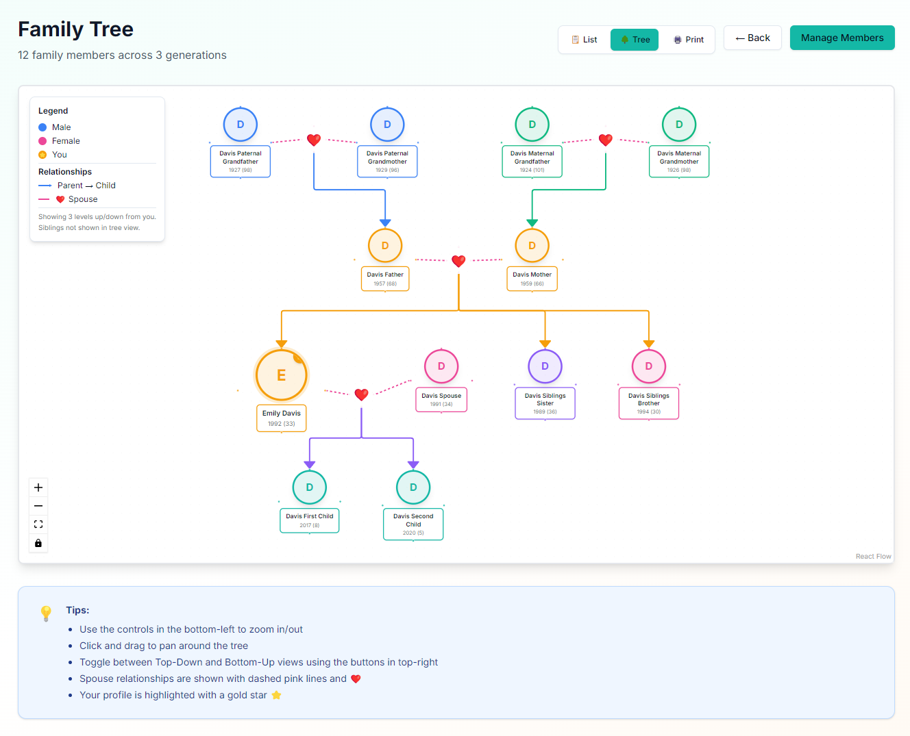
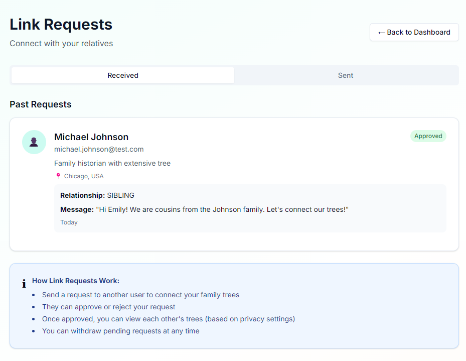
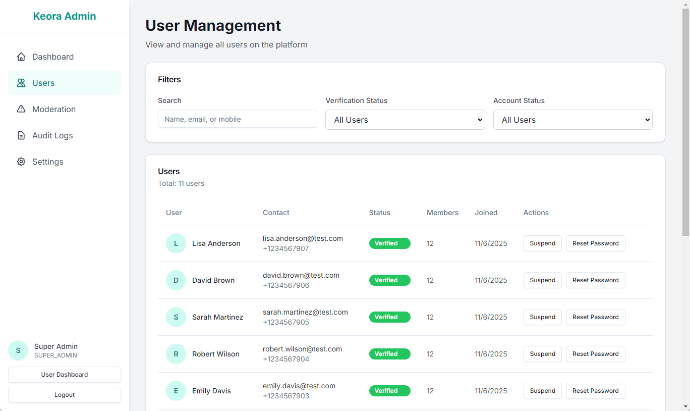
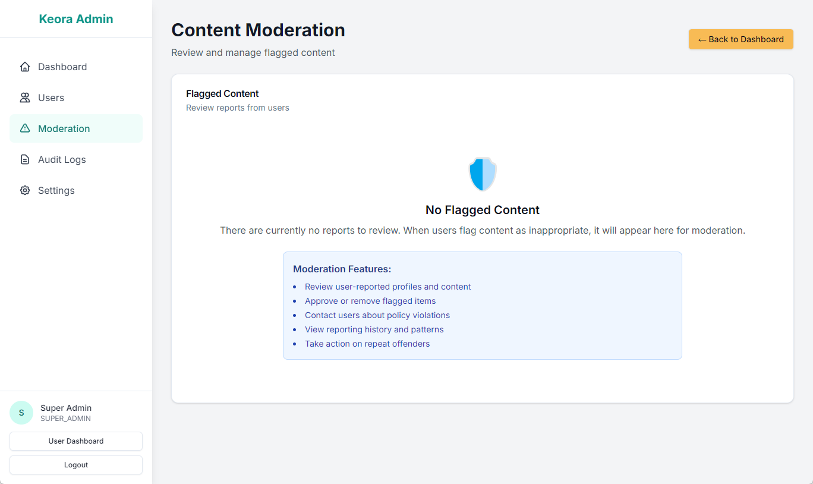

# Keora - Where Families Connect

A modern family tree platform where users can build verified family trees, connect with relatives through mutual approval, and share their heritage seamlessly.

## Preview

### Dashboard


### Family Tree View


### Link Requests


### Admin Dashboard - User Management


### Admin Dashboard - Moderation



## Features Implemented

### Core Foundation
- ✅ Next.js 14+ with App Router
- ✅ TypeScript for type safety
- ✅ Tailwind CSS for styling
- ✅ shadcn/ui component library
- ✅ Prisma ORM with PostgreSQL
- ✅ Docker & Docker Compose setup
- ✅ Zustand for state management

### Authentication & Security
- ✅ JWT-based authentication
- ✅ OTP verification system
- ✅ Password hashing with bcrypt
- ✅ Session management
- ✅ Middleware for protected routes

### Integrations
- ✅ WhatsApp OTP service (Gupshup/Interakt/Twilio support)
- ✅ Email service with beautiful HTML templates
- ✅ Multi-provider support for flexibility

### Database Schema
- ✅ Users table with verification tracking
- ✅ Family members and relationships
- ✅ Link requests with approval workflow
- ✅ Notifications system
- ✅ Tree privacy settings
- ✅ OTP codes management
- ✅ Session tracking

## Tech Stack

### Frontend
- **Framework:** Next.js 14+ (React)
- **Language:** TypeScript
- **Styling:** Tailwind CSS
- **UI Components:** shadcn/ui (Radix UI)
- **State Management:** Zustand
- **Icons:** Lucide React

### Backend
- **Runtime:** Node.js
- **Framework:** Next.js API Routes
- **Database:** PostgreSQL
- **ORM:** Prisma
- **Authentication:** JWT + bcrypt
- **Validation:** Zod

### Infrastructure
- **Containerization:** Docker & Docker Compose
- **Web Server:** Nginx (reverse proxy)
- **Cache:** Redis
- **File Storage:** AWS S3 / Cloudinary (configurable)

## Getting Started

### Quick Start

For detailed setup instructions, see **[GETTING_STARTED.md](./GETTING_STARTED.md)**

```bash
# 1. Clone and install
git clone <repository-url>
cd Keora
npm install

# 2. Setup environment
cp .env.example .env
# Edit .env with your configuration

# 3. Start database
docker-compose -f docker-compose.dev.yml up -d

# 4. Setup database (interactive)
npm run db:setup

# 5. Start development server
npm run dev
```

Open [http://localhost:3000](http://localhost:3000) in your browser.

### Documentation

- **[GETTING_STARTED.md](./GETTING_STARTED.md)** - Complete setup guide for new developers
- **[LOCAL_DEV.md](./LOCAL_DEV.md)** - Quick reference for daily development
- **[DEVELOPER.md](./DEVELOPER.md)** - Technical architecture and API documentation
- **[USER_GUIDE.md](./USER_GUIDE.md)** - End-user feature guide
- **[ADMIN_GUIDE.md](./ADMIN_GUIDE.md)** - Admin dashboard documentation

### Production Deployment

1. **Build Docker images**
   ```bash
   docker-compose build
   ```

2. **Start all services**
   ```bash
   docker-compose up -d
   ```

   This will start:
   - PostgreSQL database
   - Redis cache
   - Next.js application
   - Nginx reverse proxy

3. **Run migrations**
   ```bash
   docker-compose exec app npx prisma migrate deploy
   ```

## API Endpoints

### Authentication

#### Sign Up
```http
POST /api/auth/signup
Content-Type: application/json

{
  "name": "John Doe",
  "mobile": "+1234567890",
  "email": "john@example.com",
  "password": "securepassword",
  "dob": "1990-01-01"
}
```

#### Login
```http
POST /api/auth/login
Content-Type: application/json

{
  "emailOrMobile": "john@example.com",
  "password": "securepassword"
}
```

#### Verify OTP
```http
POST /api/auth/verify-otp
Content-Type: application/json

{
  "userId": "user_id_here",
  "mobileOTP": "123456",
  "emailOTP": "654321"
}
```

### Protected Routes

All authenticated endpoints require the `Authorization` header:
```http
Authorization: Bearer <jwt_token>
```

## Database Schema

### Users
- User authentication and profile information
- Mobile and email verification tracking
- Last login tracking

### Family Members
- Individual family member profiles
- Privacy level controls
- Relationships to users

### Relationships
- Connections between family members
- Relationship types (parent, child, spouse, sibling)

### Link Requests
- Connection requests between users
- Approval workflow
- Status tracking (pending, approved, rejected)

### Notifications
- In-app notifications
- Multiple notification types
- Read/unread tracking

### Tree Settings
- Privacy controls per user
- Search visibility
- Information display preferences

## Project Structure

```
Keora/
├── app/                    # Next.js app directory
│   ├── api/               # API routes
│   │   └── auth/         # Authentication endpoints
│   ├── globals.css       # Global styles
│   ├── layout.tsx        # Root layout
│   └── page.tsx          # Home page
├── components/            # React components
│   └── ui/               # shadcn/ui components
├── hooks/                 # Custom React hooks
├── lib/                   # Utility functions
│   ├── auth/             # Authentication utilities
│   ├── integrations/     # External service integrations
│   ├── prisma.ts         # Prisma client
│   └── utils.ts          # General utilities
├── prisma/               # Database schema and migrations
│   └── schema.prisma     # Prisma schema
├── store/                # Zustand stores
│   ├── auth-store.ts     # Authentication state
│   ├── tree-store.ts     # Family tree state
│   └── notification-store.ts # Notifications state
├── docker-compose.yml    # Production Docker setup
├── docker-compose.dev.yml # Development Docker setup
├── Dockerfile            # Application Dockerfile
├── nginx.conf            # Nginx configuration
└── README.md            # This file
```

## Development Guidelines

### Code Style
- Use TypeScript for all new code
- Follow ESLint rules
- Use Prettier for formatting
- Write meaningful commit messages

### State Management
- Use Zustand stores for global state
- Keep component state local when possible
- Use React hooks for side effects

### API Development
- Validate all inputs with Zod
- Use middleware for authentication
- Return consistent error responses
- Log errors appropriately

### Database
- Always use Prisma for database queries
- Create migrations for schema changes
- Use transactions for related operations
- Index frequently queried fields

## Security Features

- ✅ JWT token-based authentication
- ✅ Password hashing with bcrypt
- ✅ Rate limiting via Nginx
- ✅ Input validation with Zod
- ✅ SQL injection protection (Prisma)
- ✅ XSS prevention
- ✅ CSRF protection
- ✅ Secure session management
- ✅ Environment variable management

## Environment Variables

| Variable | Description | Required |
|----------|-------------|----------|
| `DATABASE_URL` | PostgreSQL connection string | Yes |
| `JWT_SECRET` | Secret key for JWT signing | Yes |
| `NEXTAUTH_URL` | Base URL of the application | Yes |
| `WHATSAPP_API_KEY` | WhatsApp API key | No |
| `WHATSAPP_API_URL` | WhatsApp API endpoint | No |
| `WHATSAPP_SENDER_ID` | WhatsApp sender number | No |
| `EMAIL_FROM` | Sender email address | No |
| `SENDGRID_API_KEY` | SendGrid API key | No |
| `RESEND_API_KEY` | Resend API key | No |
| `AWS_ACCESS_KEY_ID` | AWS access key | No |
| `AWS_SECRET_ACCESS_KEY` | AWS secret key | No |
| `AWS_S3_BUCKET` | S3 bucket name | No |
| `CLOUDINARY_CLOUD_NAME` | Cloudinary cloud name | No |
| `CLOUDINARY_API_KEY` | Cloudinary API key | No |
| `CLOUDINARY_API_SECRET` | Cloudinary API secret | No |

## Next Steps (Roadmap)

### High Priority
- [ ] Family tree visualization UI with React Flow
- [ ] Add/edit/delete family member interfaces
- [ ] User search and discovery
- [ ] Connection request UI
- [ ] Dashboard and navigation
- [ ] Profile management pages

### Medium Priority
- [ ] Tree export functionality (PDF, PNG)
- [ ] Notification center UI
- [ ] Privacy settings interface
- [ ] Image upload and management
- [ ] PWA configuration

### Low Priority
- [ ] Advanced tree visualizations
- [ ] Mobile apps (React Native)
- [ ] Multi-language support
- [ ] Premium features
- [ ] Analytics dashboard

## Contributing

1. Fork the repository
2. Create a feature branch (`git checkout -b feature/amazing-feature`)
3. Commit your changes (`git commit -m 'Add amazing feature'`)
4. Push to the branch (`git push origin feature/amazing-feature`)
5. Open a Pull Request

## License

This project is private and proprietary.

## Support

For support, please contact the development team or open an issue in the repository.

---

Built with ❤️ for connecting families
